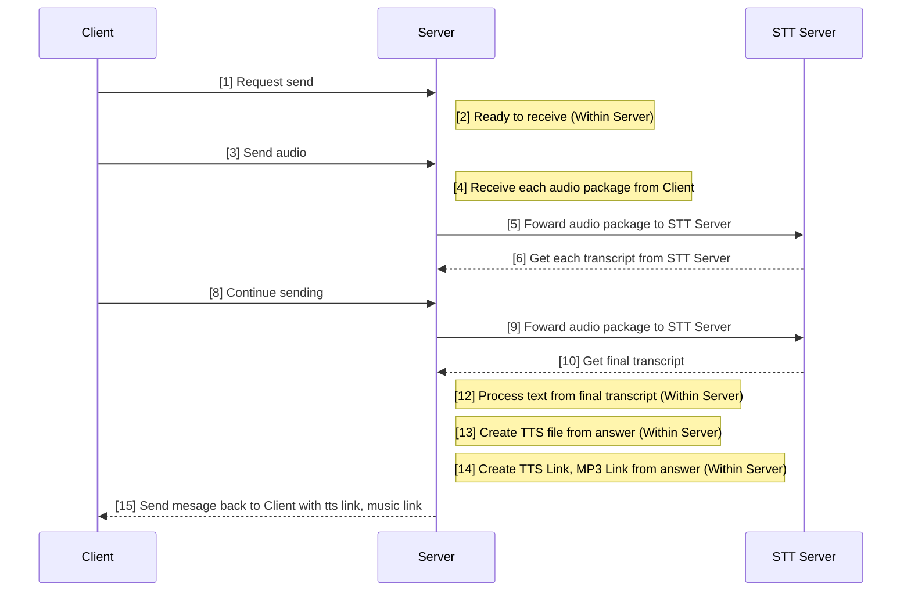

# vietbot_server
This is audio micro service listen streaming request from client, then response with tts_link or music_link

```mermaid
sequenceDiagram
    participant Client
    participant Server
    participant STTServer as STT Server

    Client->>Server: [1] Request send
    Note right of Server: [2] Ready to receive (Within Server)

    Client->>Server: [3] Send audio
    Note right of Server: [4] Receive each audio package from Client
    Server->>STTServer: [5] Foward audio package to STT Server

    STTServer-->>Server: [6] Get each transcript from STT Server

    Client->>Server: [8] Continue sending
    Server->>STTServer: [9] Foward audio package to STT Server

    STTServer-->>Server: [10] Get final transcript
    Note right of Server: [12] Process text from final transcript (Within Server)
    Note right of Server: [13] Create TTS file from answer (Within Server)
    Note right of Server: [14] Create TTS Link, MP3 Link from answer (Within Server)

    Server-->>Client: [15] Send mesage back to Client with tts link, music link
```
